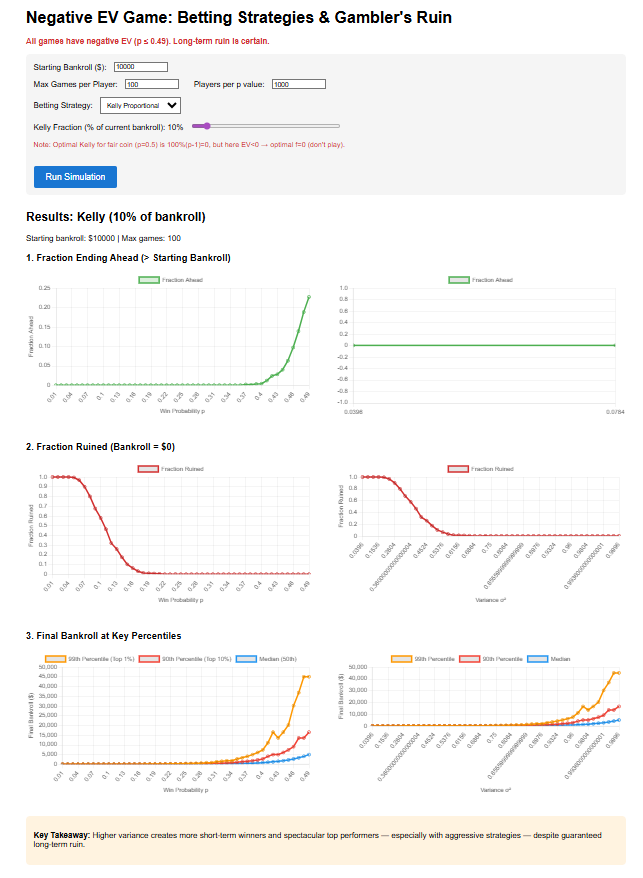

# Negative EV Gambling Simulator

Investigation was done purely from my own curiosity. Which percentile groups of people would see profits under a negative EV game?
Made with the help of Grok for scaffolding code to help with creating the react/js structure and some help with documentation. 

**Live Demo**: https://samwelllim.github.io/negative-ev-simulator/

An interactive web app that simulates betting in **negative expected value (EV) games** — like most casino games or lotteries — to demonstrate powerful behavioral and mathematical truths:

- Even in a losing game, **high variance creates many short-term winners**
- **Aggressive betting strategies** (e.g., "bet it all") produce spectacular outliers
- **Gambler's ruin**: Given enough time, **everyone goes broke** in a negative-EV game

Built with React and Chart.js.

## Key Features

- Simulate 49 different win probabilities (p = 0.01 to 0.49 → always negative EV)
- Compare three betting strategies:
  - **Bold Play** (bet your entire bankroll each time)
  - **Flat Bet** (fixed dollar amount per bet)
  - **Kelly Criterion** (proportional betting — with adjustable fraction)
- Toggle **"Simulate until ruin or 10× bankroll"** to see true long-term ruin probability (~100%)
- Visualizations:
  - Fraction of players ending ahead vs. win probability and variance
  - Fraction ruined over time
  - Final bankroll percentiles (median, top 10%, top 1%)

## What it looks like

## Why This Matters

This simulator illustrates why people are drawn to negative-EV games:
- You only see the **visible winners** (survivorship bias)
- High variance makes success feel possible
- No strategy escapes eventual ruin in an unfair game

Perfect for understanding gambling psychology, behavioral finance, and probability theory.

## Tech Stack

- React (Create React App)
- Chart.js (via react-chartjs-2)
- Deployed with GitHub Pages

## Credits

My math degree and **Grok AI**.

## License

MIT License — feel free to fork, modify, and use for education or personal projects.

---

Made with curiosity about probability, psychology, and why we keep playing losing games.